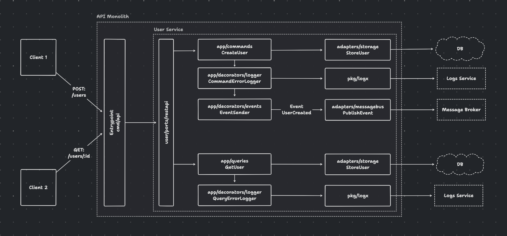
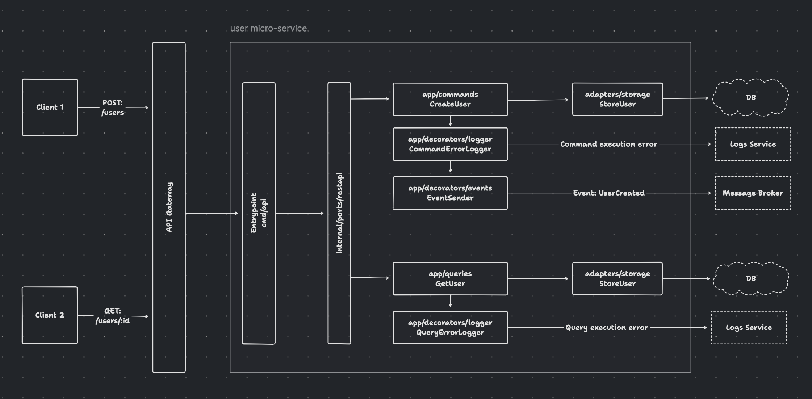

# go-smart-monolith

This is an example of a monolithic application built ready for microservice architecture. 
Each service is built as a separate package and can be easily extracted into a separate repository.

## Structure

The application is structured in a way that allows for easy transition to microservices. The application is split into the following parts:

In case you decide to split the application into microservices, you can easily do it:

## Usefull links

- [The Twelve-Factor App](https://12factor.net/)
- [The Clean Architecture](https://blog.cleancoder.com/uncle-bob/2012/08/13/the-clean-architecture.html)
- [Microservices architecture](https://microservices.io/)
- [Microservices test architecture](https://threedots.tech/post/microservices-test-architecture/)
- [Increasing Cohesion in Go with Generic Decorators](https://threedots.tech/post/increasing-cohesion-in-go-with-generic-decorators/)